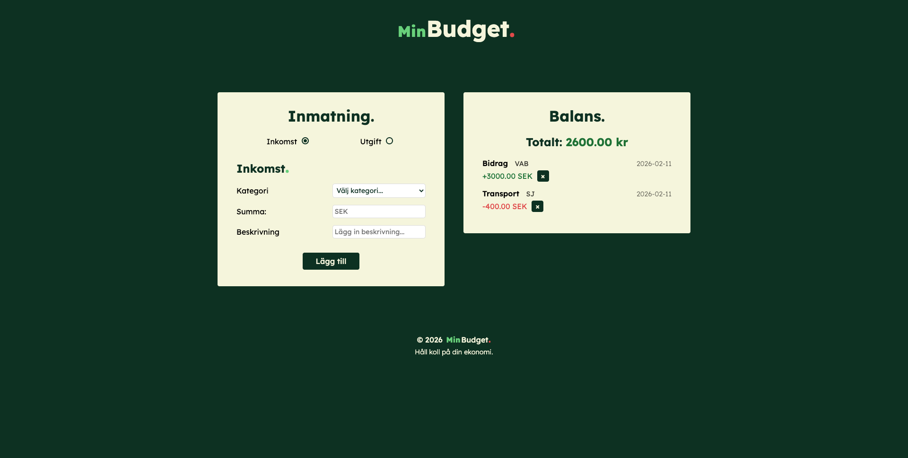
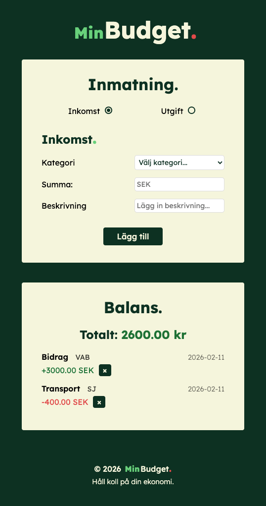
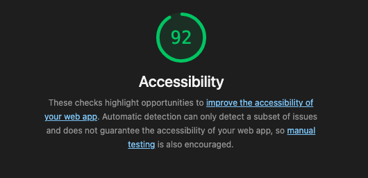
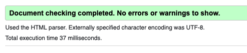

# Min Budget. 
### _En budget-app skriven i TypeScript 💸_
**Tidsåtgång:** ca 8 dagar.

---
#### Skapad av:

- [@linasvard](https://github.com/linasvard)

## Case:
> I den här uppgiften ska du skapa en liten "budget-app" där man kan mata in inkomster och utgifter, samt få en balansöversikt.

### Kort sammanfattning av innehåll - _krav_
- Dropdown-meny för att kunna välja kategori, olika baserat på val av transaktion
- Fält för att mata in utgift eller inkomst
- Fält för att beskriva tidigare input (frivillig för användaren)
- En balans som ska uppdateras varje gång användaren lägger in en transaktion
- Varje post ska kunna gå att raderas
- Ska sparas i local storage så att information finns kvar om användare stänger ner webbläsare
- Kategorier ska läsas in via JSON-fil
- Sidan ska givetvis vara responsiv och funka på både mobil och desktop 

### Tillägg - _frivilligt_
_(Detta är innehåll som jag själv implementerat och anses som extra)_

- Ett datum bredvid varje transaktionspost vilket också sparas och behålls när användaren går tillbaka till listan dagar senare
 
- Användaren kan inte skicka iväg formuläret om vissa krav inte är uppfyllda så som:
  - Enbart siffror på "Summa"-fältet
  - "Summa"-fältet måste innehålla giltiga tecken (enbart siffror)
  - Kategori måste vara vald

## Applikationen 

#### Demo

Länk till hemsidan: https://medieinstitutet.github.io/fed25d-js-inl-2-budget-app-linasvard/

---

_Desktop-läge_

_Mobil-läge_

### Beskrivning
Mörkgrön färg används som bakgrund så grönt associeras med pengar och stabilitet. Kompletterande färger som ljusgrön och röd används för att koppla till budget-appens funktion associerat med positivt respektive negativt värde.

Enkel design har använts för att kunna lägga fokus på TypeScript. Därav få, enkla färger och lättläst typsnitt i form av sans-serif.

---

### Tillgänglighetsgranskning:
Nedan visas screenshots från lighthouse-rapport. Samma resultat för både desktop och mobil därav enbart en rapport som visas. 

_**Resultat:** 92_

---

### Validering

 

_Sidans CSS och HTML är validerad_ 👆🏻